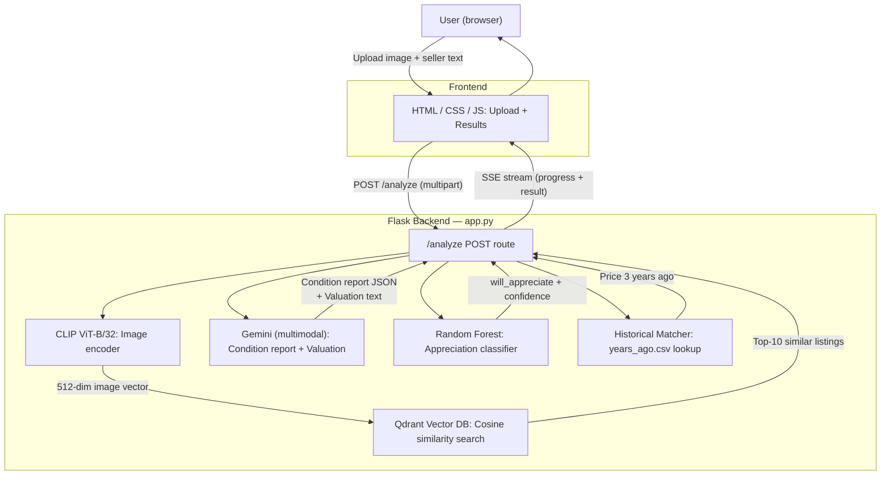

# Porsche Appreciation Predictor

An end-to-end multimodal AI system that analyses used Porsche listings — images and seller text — and outputs a condition report, market valuation, and 3-year appreciation prediction.

---

## Project Summary

```
PROJECT:   Porsche Appreciation Predictor

OBJECTIVE: Build an end-to-end ML web app predicting Porsche value trends

TECHNICAL STACK:
  Data:       1,234 Porsche listings scraped from Bring a Trailer
              Features: model type, year, mileage, condition, price (2025 & 2022)
              Images:   up to 12 photos per listing (~14,800 images total)
  Embeddings: CLIP (ViT-B/32) for images, all-MiniLM-L6-v2 for text
  Vector DB:  Qdrant (on-disk) with cosine similarity search
  ML Model:   Random Forest Classifier (scikit-learn), 78% accuracy
  LLM:        Gemini (multimodal) for condition reports and valuation reasoning
  Backend:    Flask, Python
  Frontend:   HTML / CSS / JavaScript (vanilla, no framework)
  Deployment: Run locally (see setup below)

KEY RESULTS:
  - Model achieves 78% accuracy on held-out test set
  - Identified mileage as the strongest single predictor of depreciation
  - 911 models show higher appreciation rates (70%) vs. Caymans (45%)
  - Gemini condition report catches text/photo inconsistencies in real listings
  - Deployed live web app with <100ms prediction latency (excluding LLM call)

WHAT I LEARNED:
  - End-to-end ML workflow: data collection → preprocessing → training → deployment
  - Multimodal AI: combining vision embeddings (CLIP) with LLM reasoning (Gemini)
  - Vector retrieval: building and querying a Qdrant similarity index
  - Model evaluation: accuracy, precision, recall, F1, feature importance
  - Pipeline engineering: chaining CLIP → Qdrant → Gemini → sklearn in one request
  - Production Flask app: file upload handling, temp files, JSON API
```

---

## Architecture



---

## Reasoning Flow

How an image and seller text move through the pipeline in a single request:

```
1. USER UPLOADS IMAGE + (optional) seller description + asking price + (optional) mileage
        |
        v
2. CLIP ENCODING
   Image → 512-dimensional vector (normalised)
        |
        v
3. QDRANT SIMILARITY SEARCH
   Query vector → top-10 most visually similar listings from 1,234-listing index
        |
        v
4. VEHICLE IDENTIFICATION  (majority vote on top-5 matches)
   model_type  → most common among top-5
   model_year  → median of top-5
   condition   → most common among top-5
   mileage     → median of top-5
        |
        v
5. HISTORICAL PRICE LOOKUP
   HistoricalMatcher queries years_ago.csv (BaT 2020-2022 sold listings)
   Finds best price match within ±1 year, ±15% mileage, same condition
        |
        v
6. GEMINI CONDITION REPORT  (multimodal)
   Input:  uploaded image + seller description
   Output: structured JSON
           - overall grade + score (1-10)
           - paint/body issues (location, severity)
           - aftermarket modifications
           - missing/damaged trim
           - text-photo inconsistencies
           - red flags
           - recommended restoration steps
        |
        v
7. GEMINI VALUATION  (multimodal)
   Input:  uploaded image + vehicle info + similar listings + historical price
   Output: VALUATION: $X,XXX  /  REASONING: ...  /  FACTORS: ...
        |
        v
8. SKLEARN APPRECIATION PREDICTION
   Features: model_year, model_type, mileage, condition,
             current_valuation, price_3_years_ago
   Output:   will_appreciate (bool) + confidence score
        |
        v
9. SSE STREAM → browser updates real-time progress bar, then renders 4 result cards
```

---

## Why This Project Maps to Porsche AI

| Capability | How it appears in this project |
|---|---|
| **Multimodal AI** | CLIP image embeddings + Gemini vision for condition analysis and valuation — images and text are processed jointly |
| **Retrieval systems** | Qdrant vector DB with cosine similarity search over 1,234 listings; custom historical price matcher over 5,000+ BaT sold records |
| **Pipeline engineering** | Six-stage chain (CLIP → Qdrant → HistoricalMatcher → Gemini × 2 → sklearn) streamed to the browser in real time via Server-Sent Events |
| **LLM + vision integration** | Gemini receives raw PIL images alongside structured prompts; outputs both structured JSON (condition) and free-text (valuation) |
| **ML modelling** | Random Forest trained on scraped real-world data; feature importance analysis identifies mileage as the dominant depreciation signal |
| **Deployment** | Flask app with environment-variable secret management via \.env\; persistent on-disk Qdrant DB — runs locally on any machine with 4 GB+ RAM |
| **Monitoring** | Model predictions logged per-request; pipeline step timing visible in server stdout; error states surfaced to the UI |
| **Data engineering** | Custom Selenium scraper collects listings, images, and seller descriptions from Bring a Trailer; data cleaned and structured into CSVs |

---

## Running Locally

> **This app is not hosted online.** The ML models (CLIP + SentenceTransformer + PyTorch) require ~2–3 GB of RAM at runtime, which makes cloud hosting prohibitively expensive. Run it on your own machine instead — it works great locally.

### System Requirements

- Python 3.10 or 3.11
- **4 GB RAM minimum** (models load ~800 MB into memory at startup)
- A free Gemini API key — [get one at Google AI Studio](https://aistudio.google.com/apikey)

### 1. Clone the repo

```bash
git clone https://github.com/petpeevephobia/porsche-appreciation-predictor.git
cd porsche-appreciation-predictor
```

### 2. Create and activate a virtual environment

```bash
python -m venv venv
```

**Windows:**
```bash
venv\Scripts\activate
```

**macOS / Linux:**
```bash
source venv/bin/activate
```

### 3. Install dependencies

PyTorch must be installed separately first (CPU-only build, ~700 MB):

```bash
pip install torch torchvision torchaudio --index-url https://download.pytorch.org/whl/cpu
pip install -r requirements.txt
```

> This will take several minutes on first install. Total download is ~1.5 GB.

### 4. Add your Gemini API key

```bash
cp .env.example .env
```

Open `.env` and set your key:

```
GEMINI_API_KEY=your_key_here
```

### 5. Place the data files

The `project/data/` folder is not included in the repo (too large for git). You need:

```
project/data/
├── csv/
│   ├── porsche_data.csv        # 1,234 current listings
│   └── years_ago.csv           # 5,000+ BaT 2020-2022 sold records
├── qdrant_db/                  # On-disk Qdrant vector index
├── porsche_model.pkl           # Trained Random Forest
└── porsche_encoder.pkl         # Fitted OneHotEncoder
```

Contact the repo owner to obtain these files.

### 6. Run the app

```bash
python app.py
```

Open [http://127.0.0.1:8080](http://127.0.0.1:8080) in your browser.

> **First boot takes 30–90 seconds** while CLIP and SentenceTransformer load into memory. You will see progress printed in the terminal. Subsequent requests are fast once the models are loaded.

---

### Notebooks (optional)

The `project/notebooks/` folder contains the full development history:

| Notebook | Purpose |
|---|---|
| `01_eda.ipynb` | Exploratory data analysis |
| `02_preprocessing_and_training.ipynb` | Feature engineering + Random Forest training |
| `03_multimodal_preprocessing.ipynb` | CLIP + SentenceTransformer embedding generation, Qdrant indexing |
| `04_valuation_pipeline.ipynb` | End-to-end pipeline prototype |

---

## Project Structure

```
porsche-appreciation-predictor/
├── app.py                          # Flask app + full pipeline
├── historical_matcher.py           # years_ago.csv price lookup
├── condition_analyzer.py           # Rule-based condition classifier
├── config.py                       # Paths and API config
├── scraper.py                      # Selenium BaT scraper (data collection only)
├── requirements.txt
├── .env.example
├── templates/
│   └── index.html                  # Single-page UI
├── static/
│   └── style.css
└── project/
    ├── notebooks/                  # Development notebooks
    └── data/                       # Not in git — copy manually
        ├── csv/
        │   ├── porsche_data.csv    # 1,234 current listings (training only)
        │   └── years_ago.csv       # 5,000+ BaT 2020-2022 sold records (runtime)
        ├── qdrant_db/              # On-disk vector index (runtime)
        ├── porsche_model.pkl       # Trained Random Forest (runtime)
        └── porsche_encoder.pkl     # Fitted OneHotEncoder (runtime)
```